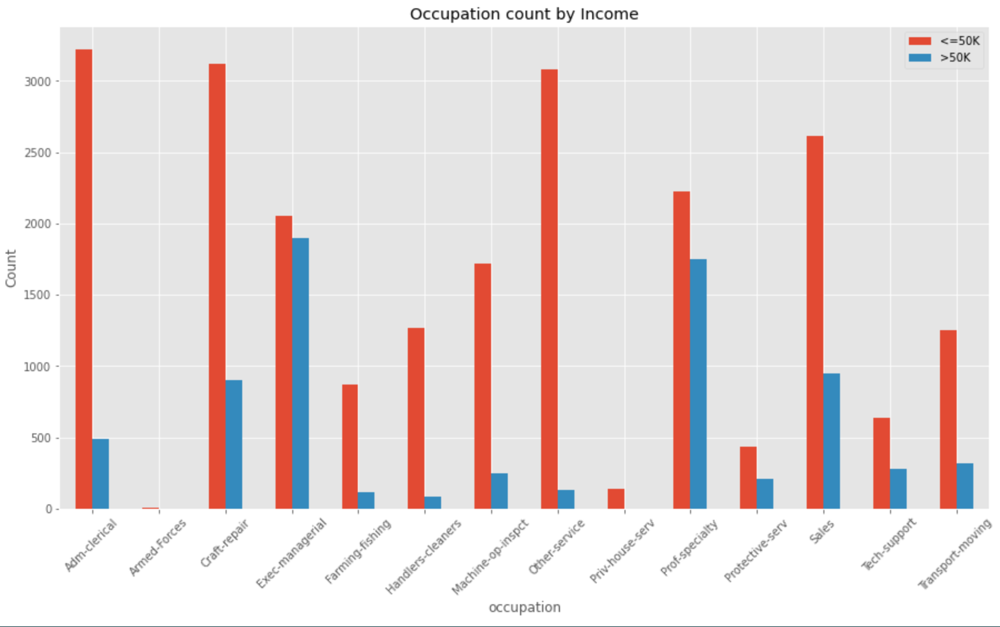

<!DOCTYPE HTML>

<html>
	<head>
		<title>Mandy Kan's Portfolio</title>
		<meta charset="utf-8" />
		<meta name="viewport" content="width=device-width, initial-scale=1, user-scalable=no" />
		<link rel="stylesheet" href="assets/css/main.css" />
	</head>
	<body class="is-preload">

		<!-- Header -->
			

				
				<h1>Hi. This is Mandy.</h1>
				
A technology enthusiast who enjoy problem solving and passionate about data science & business intelligence!
					 Welcome to connect with me on <a href="https://www.linkedin.com/in/mandkan/">linkedin</a> to know more about me!
				

			

		<!-- Main -->
			

				<header class="major container medium">
					<h2>See the details of some of my
					 
					Python Web Scraping 
					 
					and Data Science Projects
				</header>

				

					<section class="feature left">
						
						

							<h3><a href="project1.html">Income Prediction Project</a></h3>
							
Aims: To build a model for segmentation on customers. i.e. to identify high-value customers for better targeting
							

						

					</section>
					<section class="feature right">
						
						

							<h3><a href="project2.html">Job Market Trend Analysis</a></h3>
							
Aims: To understand the recovery of job market under COVID-19 pandemic and investigate in the increasing IT talents demands.
							

						

					</section>

					<section class="feature left">
						
						

							<h3><a href="other.html">Other Python Projects</a></h3>
							<li>A Flask Web App for titanic survival prediction.</li>
							<li>Simple Tic-tac-toe</li>
						

					</section>
					
				

				<footer class="major container medium">
					<h3>Just want to check out code?</h3>
					<ul class="actions special">
						<li><a href="https://github.com/mand-kan" class="button">View more on Github</a></li>
					</ul>
				</footer>
				

			

		<!-- Footer -->
			

					<ul class="icons">
						<li><a href="https://github.com/mand-kan" class="icon brands fa-github">Github</a></li>
	
					</ul>
					<ul class="copyright">
						<li>&copy; Mandy Kan. All rights reserved.</li>
					</ul>

				

			

		<!-- Scripts -->
			
			
			
			
			

	</body>
</html>